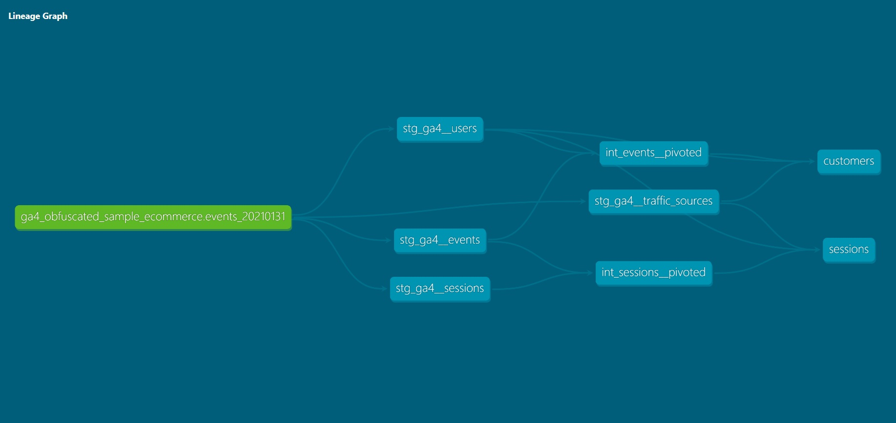

# GA4 dbt Project

This project builds analytics-ready models on top of **Google Analytics 4 (GA4)** BigQuery export data using **DBT (Data Build Tool)**. 

**DBT** focuses on the transformation side of **ETL**  once it has already been loaded into the warehouse, turning raw source tables into clean, tested, and analytics-ready datasets through modular SQL models, version control, and automated testing.

The pipeline follows a **layered design** with **staging (stg)**, **intermediate (int) marts**, **macro helpers** for reusability, and **core data marts (fct/dim)** for downstream analytics.

---

## 🧩 Layered Model Design

### 1. **Staging Layer (`staging/`)**
- Cleans and standardizes raw GA4 export tables.
- Defines **sources** (`_ga4__sources.yml`), **models** (`_ga4__models.yml`) and applies **naming conventions** following the best-practices for consistency.
- Example:
  - `stg_ga4__events` → flattened events
  - `stg_ga4__sessions` → sessionized activity
  - `stg_ga4__users` → user metadata
  - `stg_ga4__traffic_sources` → traffic attribution
### 2. **Marts Layer (`marts/`)**
- Aggregates and pivots GA4 data for analysis.
- Models:
  - `int_events__pivoted` → **event-level**, pivoted counts by event name and browser
  - `int_sessions__pivoted` → **session-level**, enriched with engagement and traffic info
  - `customers` → **user-level data mart**, aggregates user activity across events, sessions, and traffic
  - `sessions` → **session-level data mart**, user + traffic + geo + device context
### 3. **Macros (`macros/`)**
- `pivot_helpers.sql` → DRY helper for pivoting event counts  
  (avoids repeating long `CASE WHEN` or `COUNTIF` expressions across marts).

---

## 🕸️ Lineage Graph



---

## ✍️ Notes on Design Choices

- Staging → marts pattern ensures clean lineage and modularity.
- Macros reduce repetition when pivoting GA4 events.
- Intentional uniqueness `data_test` failure (e.g. in customers → signals real-world grain complexity).
  - Reason: a single user can have **multiple traffic sources**, leading to >1 row per user.  
- Sessions + Customers marts provide ready-to-use models for segmentation, attribution, and lifetime analysis.

---

## 📜 Requirements

- python
- dbt-bigquery adapter installed using `pip install`
- Access to a GA4 BigQuery export dataset
- Access to Git

--- 

## 📥 Cloning this Project Repository for testing

❗Note: This workflow assumes that you have your database in BigQuery already setup. 

1. Clone this repo to your local directory by executing the command:
    ```bash
    git clone https://github.com/psyger99/ga4_dbt_project.git
    ```
2. Setup a python virtual environment and install the adapter by running the commands below.
    ```bash
    python -m venv .venv
    source .venv/Scripts/activate
    pip install dbt-bigquery
    ```
3. Create and configure the `profiles.yml` to connect your dbt to BigQuery. It should look like this:
    ```bash
    <name_of_your_dbt_project>:
      outputs:
        dev:
          dataset: <name_of_your_bgq_project_dataset>
          job_execution_timeout_seconds: 300
          job_retries: 1
          keyfile: <path_to_your_service_account_key.json>  
          location: US
          method: service-account
          priority: interactive
          project: <name_of_your_bgq_project>
          threads: 4
          type: bigquery
      target: dev
    ```
4. Modify the `dbt_project.yml` by changing the `profiles:` parameter to `<name_of_your_dbt_project>` that matches the `profiles.yml`.
5. Run the following commands (in order):
    - `dbt clean` - to ensure that files in the `target/` directory are deleted.
    - `dbt debug` - this will let you know if your connection to your data warehouse has been successful.
    - `dbt parse` - to check the model (yaml) if valid, checks syntax and catches mistakes.
    - `dbt build` - to run models, tests, seeds, and snapshots in the correct dependency order.
    - `dbt docs generate` - to generate the documentation content in `target/` directory.
    - `dbt docs serve` - to serve and display the documentation website locally which will redirect you to: `http://localhost:8080/`

---

## 🛠️ Simple dbt Project Workflow Tips

1. Execute `dbt --version` in the terminal.
2. Initialize a dbt project using the command `dbt init <project_name>`.
3. Modify the following connection and project configurations inside:
    - `profiles.yml`
    - `dbt_project.yml`
4. Ensure the dbt to BigQuery data warehouse connection is running by executing the command: `dbt debug`. All checks must pass, else configure base on needs.
5. Once it is connected successfully, create the source (`stg`) and or seed (if you have any) data, including the schema.yml.
    - There should be atleast 1 `schema.yml` per type of models.
    - Place your seed data in the `seeds/` directory.
6. Execute the command `dbt seed` to load csv files (or other files with delimited format) located in the seed-paths directory of your dbt project into BigQuery.
7. Use the command `dbt compile --select <model>` to translate your dbt model (SQL + Jinja) into executable SQL that BigQuery can understand, without commiting it fully to the cloud. The result of compilation is written to the target/ directory in your dbt project.
8. If the compilation satisfy the desired outcome, proceed to execute `dbt run --select <model>`.
9. Check your database in BigQuery if it reflects successfully.
10. Add `data_tests` in your schema or `tests` in tests-path directory. To learn more about testing, proceed here:
    - [data_tests 🔗](https://docs.getdbt.com/docs/build/data-tests)
11. Execute the following command based on type of testing:
    - `dbt test` - Run Data and Unit Test
    - `dbt test --select <model>,test_type:data` - Run only data tests
    - `dbt test --select <model>,test_type:unit` - Run only unit tests
12. Create the intermediate and core data models with schema configuration.
13. Run the test for those model(s).
14. (Optional) Executing the command `dbt build` will run the seeds, models, tests, and snapshots (if you have any) in the correct dependency order, handling the full lifecycle of dbt resources.

---

## To learn more about dbt
- Check this out: 
    - [dbt introduction 🔗](https://docs.getdbt.com/docs/introduction)
    - [dbt best practices 🔗](https://docs.getdbt.com/best-practices)

---

## Glad you reached the end of this repository!